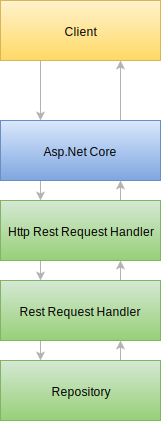

# Rest server
These libraries support developing Rest services (Richardson maturity model level 3), in a protocol-agnostic way, on top of which HTTP is supported.
It tries to adhere to the original meaning of the word 'Rest', contrary to what is found on the web in abundance, something which may better be called Web Apis.
Additionally the Rest services can be served over an HTTP connection by using ASP.Net Core.

## Architecture
_(The information below is a short summary, the main article about the architecture can be found [here](./arch.md))_

Two main components form the backbone of a Rest API developed using these libraries:
* A Rest component that specifies all the interfaces and helper classes needed to implement a Rest service.
* An ASP.Net Core component that exposes a Rest service implementation over HTTP.

An `IRestRequestHandler` is responsible for routing a `RestRequest` to a repository.
The repository is responsible for answering a `RestRequest` with a `RestResponse`. 
An `IHttpRestRequestHandler` is responsible for transferring information from the Http context to the `RestRequest`. 
It is also responsible for transferring information from the `RestResponse` back to the Http context.

Below is an image of a layered view of this process:

## Identity
This library uses the Biz.Morsink.Identity library for identifying entities. 
Every resource in the Rest server corresponds to a type and an identity value.
The Rest pipeline and the actual serving of content over HTTP is only coupled at runtime.
No static dependencies are present.

## Aspects
The following aspects come into play when designing a Rest repository:
* Identity (covered by the dependency).
* Home resource
* Caching
* Operation (e.g. HTTP methods).
  Operation maps to operation interfaces.
* Entities and objects versus resources.
* Schema and metadata.
* Content-Type and transformation.
* Serialization/Deserialization.
  Should be configurable per content type. 
* Result type.
  * Asynchrony.
  * Lazy evaluation.
  * Status and failure (e.g. HTTP status codes/exceptions).
  * Result class.
  * Links.
  * Embedded objects.
* HATEOAS.
  * In order to be fully Rest compliant everything must be navigable by content retrieved from the Rest Server.
  * This includes manipulation methods and their input schemas.
* Security.
  * Based on access checks for identity values/paths.
* Navigation.
  * LinkProviders.
* Paging.
* Versioning & Deprecation.

### Home resource
The home resource, located at `"/"`, is the entry point for the API and provides links to all the resources that can be queried by the client.
* Either the API is fully public, so it does not need to know *who* is accessing the API.
* Or the API is fully private, so it will reply with a 401 whenever it is accessed without credentials.
  The 401 should contain a link to a login.
* Or the API is partially private.
  A 200 response should be given on accessing the home resource. 
  It should contain only links that are available to anonymous users and a link to the login, if there are no credentials supplied.
  Whenever a protected resource is accessed, a 401 response should delegate to the login at that time.

### Operation interfaces
At least two ways of implementing operation interfaces are possible:
* Have a specific interface per operation with the resource as a generic parameter (`IRestGet<T>`, `IRestPut<T>`, etc.).
* Have an interface implementation per resource `IRestRepository<T>` which allows for capability discovery.
  Capability discovery should expose the same interfaces for its implemented operations.

The precise specification of the operation interfaces depends on the specification of the `Result` type.

An operation interface should not be equal to an HTTP method, but there should be a mapping.
When dealing with entities, often there is a preference for specifying 'CRUD' operations. 
However, CRUD deals too much with the implementation of the back-end layer, whereas the HTTP methods deal more with what kind of guarantees are tied to the different methods.
For this reason, we at least need to specify the following interfaces:
* IRestGet
* IRestPut
* IRestPost
* IRestPatch
* IRestDelete
These interfaces should have the same constraints as the corresponding HTTP methods:

| Interface   | Method | Safe | Idempotent |
| ----------- | ------ | ---- | ---------- |
| IRestGet    | GET    | Yes  | Yes        |
| IRestPut    | PUT    | No   | Yes        |
| IRestPost   | POST   | No   | No         |
| IRestPatch  | PATCH  | No   | No         |
| IRestDelete | DELETE | No   | Yes        |

### Entities, objects, resources

> **Definition:** A resource is anything that can be addressed by a URI.

> **Definition:** An entity is a resource that adheres to a certain model.

> **Definition:** An object is an instance of an entity.

Resources can either be entities or non-entities.
An entity can be represented by an abstract model and can be serialized into a representational form.
Non-entities often already have a representational form (JPG image, HTML page, PDF document, etc.).

An object is an instance of an entity model and can be used to convert to and from the representational form. 
The Rest component is responsible for handling these objects, whereas the server component is responsible for converting it to and from the representational form.
Non-entities are handled by the server component only.
Of course, it is also possible to let ASP.Net Core handle static files (non-entities) using the UseStaticFiles() extension method.

### Schema and metadata
All entities link to a schema, defining the structure of that entity.
This is based on the `TypeDescriptor` of that entity.
Please refer to the section about [Type Descriptors](typeDesc.md) for further information.

### Content-Type and serialization
This is purely an HTTP aspect. 
The Rest service delivers a `RestResponse` which must be translated into a `HttpResponse`.
Part of this transformation is determining in what format the response needs to be serialized.

Determination of the Content-Type is affected by the following factors:
* Constraints of the resource.
  Non-entities may have a fixed Content-Type.
* Capability of the HTTP server.
  The server has support for different Content-Types based on registered plugins.
* `HttpRequest`'s Accept header.
* Request path/query string parameter hints. 
  This could be necessary when the Accept header cannot be set.

When the Content-Type is selected, the corresponding serialization can be used if necessary.
The serialization strategy is responsible for populating the `HttpResponse` with all the information in the `RestResponse` that is appropriate for the format.
This includes dealing with different Rest aspects and the format's support for them.

### Result type
The `RestResponse<T>` and `RestResult<T>` classes are an abstraction over a subset of HTTP responses.
They should support everything that is needed for Rest.

#### Asynchrony
All relevant, possibly asynchronous methods, in classes and interfaces make use of `Task`/`Task<T>`/`ValueTask`/`ValueTask<T>`.
Also, support for these asynchronous types (as return types) has been implemented for use in repositories.

#### Lazy evaluation
The actual result of a `RestResponse` might not be needed to fullfil the `HttpRequest`, therefore the evaluation of the requested resource should be delayed until it is necessary.
For this purpose a `LazyRestValue<T>` type has been designed.

#### Result class, status and failure
Status and failure has been modelled into a disjoint union type called `RestResult<T>`.
This class contains any error information when applicable and the actual value when successful.
If a failure result cannot be communicated by return values, throwing a specific `RestFailureException` or `HttpException` is an easy workaround.
Please refer to [Rest Values](values.md) for further information about results.

#### Links and navigation
The result is able to contain links to navigation targets.
You can either implement the addition of links in repository methods or through registration of `ILinkProvider<T>` and `IDynamicLinkProvider<T>` dependencies.
The links can be contained in a separate collection in the result/response, either in the body or headers.

#### Embedded objects
There is support for embedding objects in a response which are not strictly part of the requested entity, but might enhance total performance when embedded.
If and how the embedding is actually serialized depends on the Http converter for the media type.

#### HATEOAS
From a library perspective all content and functionality needs to be navigable.
For `GET` operations it is implemented through the proper translation of `IIdentity<T>` values to HTTP addresses. 
All `GET` operations respond with at least a link to the value's `TypeDescriptor`, which should be serialized in some schema language.
For `GET` query string and other operations there needs to be schema information for input.
All addresses can be accessed with the `OPTIONS` method, which will enumerate all capabilities and schemas for the address.

#### Security 
An `IAuthorizationProvider` interface is provided to determine access authorizations for principals to operations on entity instances.
It is also used to filter out inaccessible links in Rest responses.

#### Paging
Paging can be made Restful by including navigation links.
The class `RestCollectionLinks<T,E,I>` does this by implementing `IDynamicLinkProvider<T>`.

#### Versioning and deprecation
Versioning is done by using the `Versioning` metadata object.
Using this object results in `Version` and `Supported-Versions` headers.
Multiple structural versions of the same entity are able to live in the same address space.
Depending on the `Version` header the actual entity type is chosen and the object serialized.

Deprecation can be done manually by the implementation of repositories.

## Examples of requests

### Simple GET
1. A GET Request is made for `"/api/Person/Joost"`.
2. The ASP RestServer has a PathIdentityProvider translating it to an `Person("Joost")` identity.
3. The Rest repository is queried for `IRestGet<Person>`.
4. The `IRestGet<Person>` is passed the `Person("Joost")` value and returns a corresponding `RestResponse<Person>` object.
5. The ASP RestServer inspects the object and determines the best available serialization format by inspecting the Accept header.
6. The serializer is called to serialize the `Person` object.

### Search
1. A GET Request is made for `"api/Person?search=Joost"`
2. The ASP RestServer translates this to a `PersonCollection(["search" => "Joost"])` identity.
3. The ASP RestServer translates the parameters into a dictionary object.
4. The Rest repository is queried for `IRestGet<PersonCollection>`. The dictionary type is implicit because the Identity library hides underlying types.
5. The `IRestGet<PersonCollection>` is passed the identity value and retrieves a `PersonCollection` which contains paging details. 
   These details include links to other pages and a total count.
6. The ASP RestServer inspects the object and determines the best available serialization format by inspecting the Accept header.
7. The serializer is called to serialize the `PersonCollection` object.

The `PersonCollection` type could derive from some abstract type that allows paging.

### Post
How does a client know what to POST?
1. Client navigates to the Home resource `"/"`.
2. The server's return value contains a link to the person collection `"/Person"`.
3. Making an HTTP Options request to `"/Person"`
4. The result contains all capabilities and schema information for query string, request bodies and response bodies.
5. Now the client knows what schema to use to construct a request to post to `"/Person"`.
